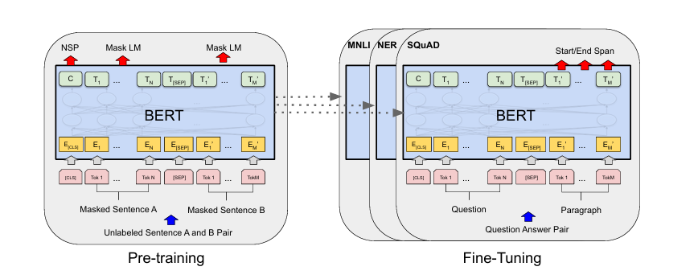
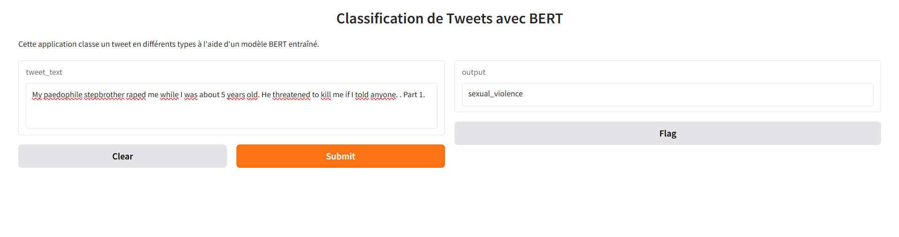

# Classification des types de Tweet avec BERT

# Avant-Propos

Dans le cadre du cours de Deep Learning II, nous étions invité à fine-tuné le modèle de BERT pour la classification des types de tweets. un corpus a été mise en oeuvre pour ce travail. 

C'était vraiment un bon exercice pour nous apprenant dans la spécialisation de Data science. nous ne cesserons pas de remercier l'Enseignant du cours de Deep Learning II, pour ses enseignements et orientations dans le domaine de Deep Learning.

## Présentation du Projet

Ce projet vise à analyser les types des tweets sur un ensemble de données en s'appuyant sur le modèle BERT perfectionné pour la classification des tweets, avec une attention particulière portée à la détection des types des tweets. Grâce aux capacités avancées de compréhension du langage naturel de BERT, le modèle peut identifier et catégoriser efficacement les contenus dans les tweets, contribuant ainsi à un environnement en ligne plus sûr. 

## Objectif du Projet

L'objectif principal est de classer les tweets en fonction des types suivants: sexual_violence, Physical_violence, emotional_violence, Harmful_Traditional_practice, economic_violence. 

Comme nous l'avons dit précédement, le projet utilise **BERT** (Bidirectional Encoder Representations from Transformers), un modèle de pointe pour les tâches de traitement du langage naturel, afin d'atteindre une grande précision. Après l'entrainement du modèle par BERT. Nous avons créer une interface avec gradio pour la classification de tweets en fonction de type. gradio a été préfére par l'enseignant vu qu'il offre une interface web conviviale pour l'analyse des types des tweets en temps réel. 

## Caractéristiques du modèle BERT

## 0. L'Architecture de BERT

Figure 1 : Procédures globales de pré-entraînement et de réglage fin pour BERT. Hormis les couches de sortie, les mêmes architectures sont utilisées pour le pré-entraînement et le réglage fin. Les mêmes paramètres de modèle pré-entraînés servent à initialiser les modèles pour différentes tâches en aval. Lors du réglage fin, tous les paramètres sont ajustés. [CLS] est un symbole spécial ajouté devant chaque exemple d’entrée, et [SEP] est un jeton de séparation spécial (par exemple, séparant les questions et les réponses).

### 1. Classification des tweets basée sur BERT

Le projet utilise un modèle BERT optimisé pour classer les tweets et identifier ceux qui contiennent des types de tweets.
**Utilisation :** La capacité de BERT à comprendre le contexte et les nuances de langage le rend très efficace pour des tâches telles que la detection des types de tweets.
**Fonctionnement :** Le modèle traite les tweets d'entrée et les affecte à des catégories prédéfinies (par exemple, sexual_violence, Physical_violence, emotional_violence, Harmful_Traditional_practice, economic_violence) en fonction du contenu détecté.

### 2. Modèle BERT optimisé

Le modèle BERT utilisé dans ce projet a été optimisé spécifiquement pour la détection du type de tweet.

**fonctionnement :** Le modèle BERT pré-entraîné est ensuite entraîné sur un ensemble de données contenant des exemples de tweets de harcèlement et de non-harcèlement, ce qui affine sa capacité à distinguer les deux.

**A.Préparation de l'environnement**

Par rapport à ce point nous voyons l'installations des toutes bibliothèques nécessaires pour la mise en oeuvre de cet entrainement avec BERT, nous avions vérifier faits quelques statistiques sur la variable type juste pour avoir une vision de l'ensemble.

**Chargement de jeu des données**

La taille de notre dataset est de **39650** et **3 variables (ou colonnes)** :

 - *1ere colonne* : **Tweet_ID**
 - *2eme colonne* : **tweet**, ici nous avons les textes ou les tweets
 - *3eme colonne* : **type** ou la catégorisation des textes.

**N.B :** nous avons utilisé un echantillon de 1000 textes, pour palier au problème de memoire, vous pouvez consulter les articles [BERT: Pre-training of Deep Bidirectional Transformers for Language Understanding](https://arxiv.org/pdf/1810.04805) et [transformer préprocessing sur le site huggingface](https://huggingface.co/docs/transformers/main/en/preprocessing), [REVISITING FEW-SAMPLE BERT FINE-TUNING](https://arxiv.org/pdf/2006.05987), [Effectiveness of Pre-training for Few-shot Intent Classification](https://arxiv.org/pdf/2109.05782), [A Comparison of LSTM and BERTfor Small Corpus](https://arxiv.org/pdf/2009.05451)

## Transformations des données

Nous vous présentons l'architecture que nous avions utilisé tiré dans un papier. 

Cette architecture, nous a permis de transformer nos inputs et d'attendre une bonne sortie 

## Modelisation avec Bert

Durant cette phase, le modèle a été formé de manière non supervisée, sans données labellisées, sur deux tâches spécifiques.

- Masked Language Modeling, c’est-à-dire la modélisation du langage masqué (MLM) consiste à demander au modèle de prédire des mots intentionnellement masqués dans une phrase. Le modèle devait deviner ces mots masqués en se basant sur le contexte fourni par les autres mots de la phrase.
- Next Sentence Prediction, en français, prédiction de la phrase suivante (NSP). L’objectif est de faire prédire au modèle la séquence de mots suivante. Cette tâche vise à permettre au modèle de comprendre la continuité entre des phrases consécutives.

Après la phase de pré-entraînement, BERT est fine-tuné sur des tâches spécifiques. Des couches supplémentaires s’ajoutent et sont entraînées sur des données annotées. Elles permettent à BERT de s’adapter aux exigences de tâches particulières. 

## Resultats avec gradio

## CONCLUSION

Selon nos résultats expérimentaux, nous avons signalé que BERT peuvent améliorer les performances du classificateur dans différentes configurations de formation. notre modèle à fait une bonne classification, donc nous pouvons retravailler encore dans cette partie pour améliorer le travail.